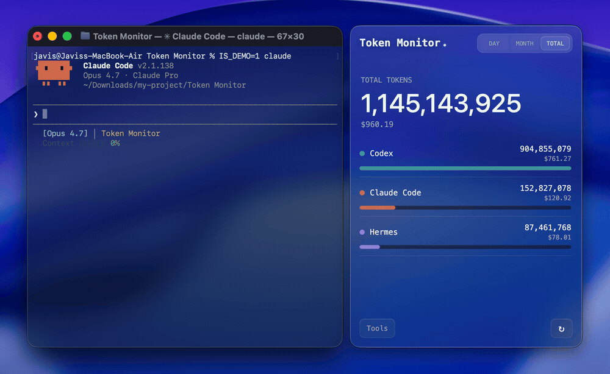
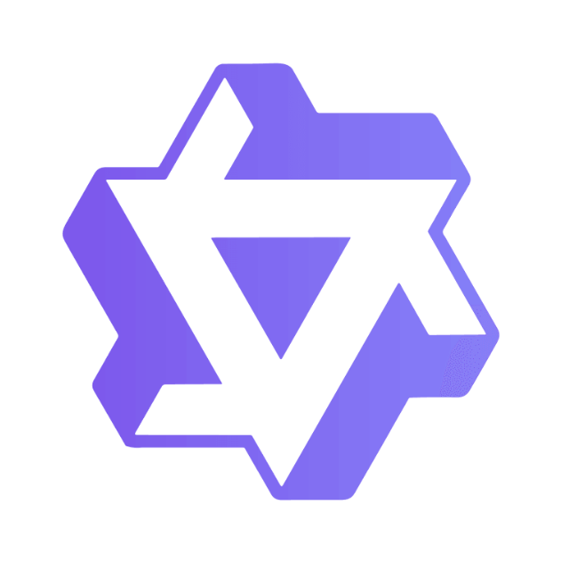
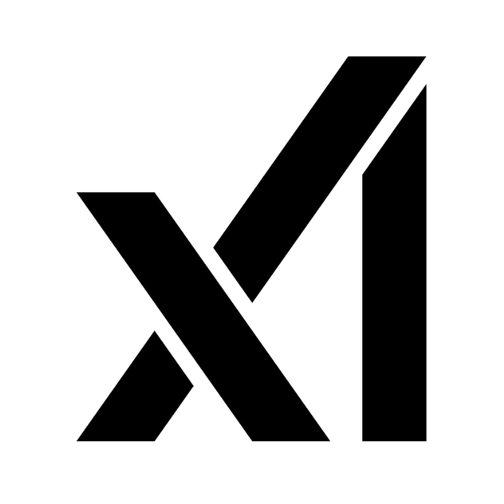
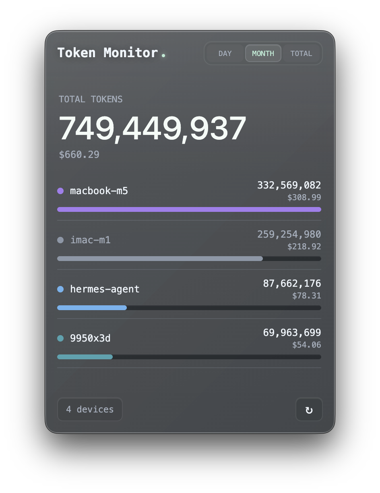
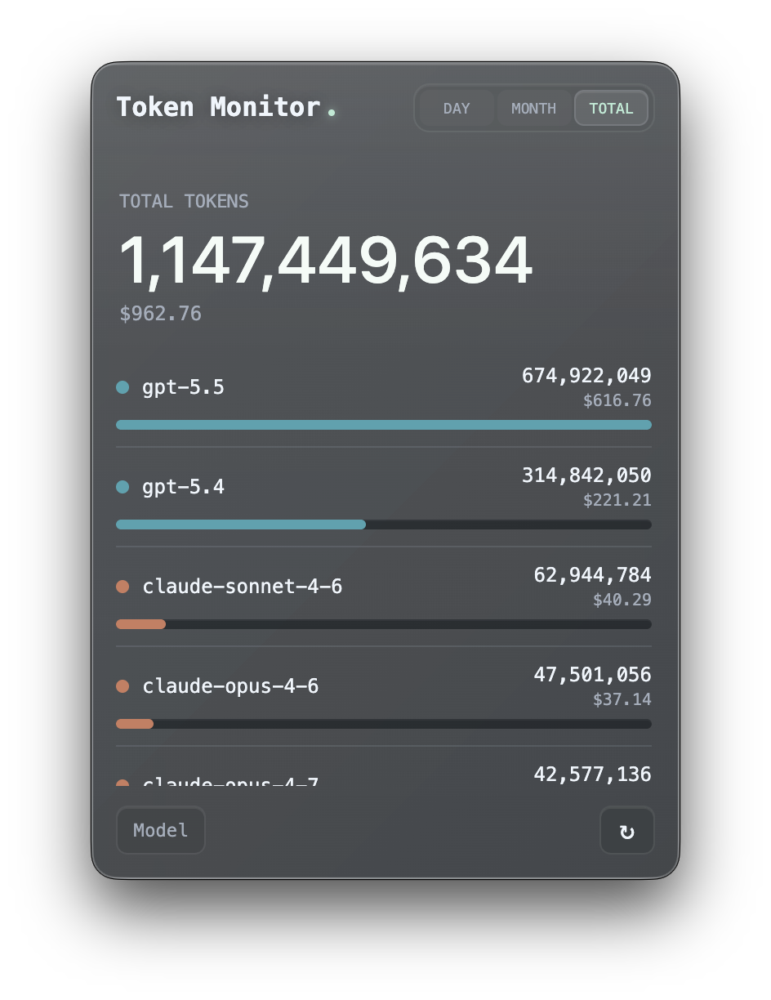
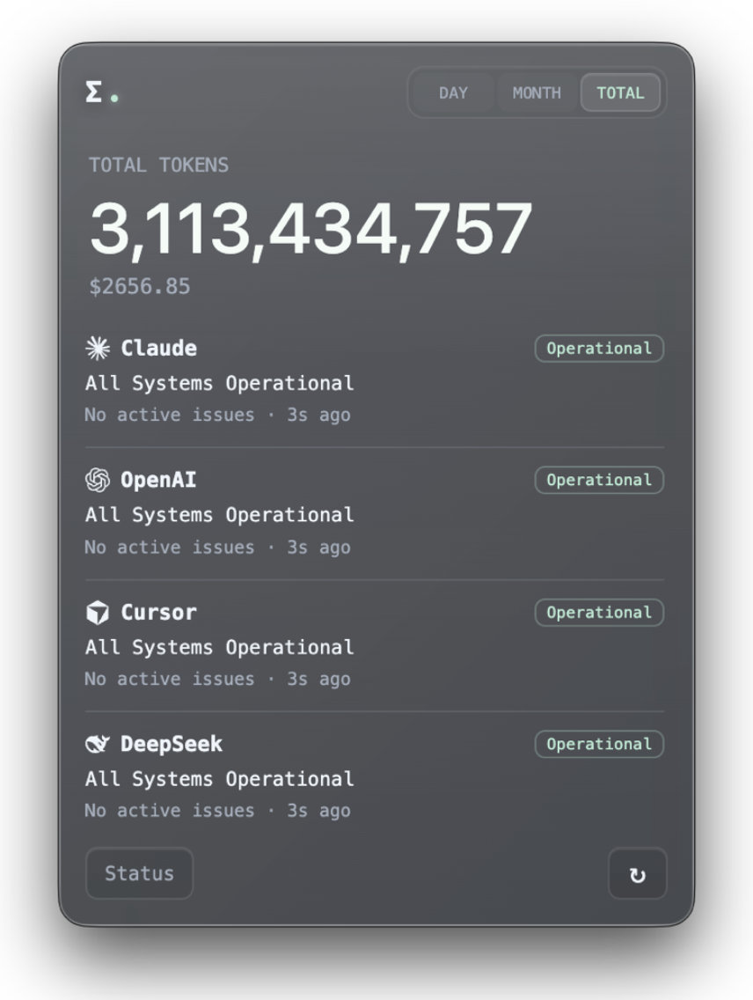

<p align="right">
   <strong>EN</strong> | <a href="./README.zh-CN.md">简</a> | <a href="./README.zh-TW.md">繁</a>
</p>
<div align="center">
    
    <h1>Token Monitor</h1>
</div>

<p align="center">
    <em>One live dashboard for every AI coding tool, synced across every machine.</em>
</p>

<p align="center">
    <a href="https://github.com/Javis603/token-monitor/releases"></a>
    <a href="https://github.com/Javis603/token-monitor/releases"></a>
    
    
    
    <a href="https://discord.gg/HmdNVVvw5P"></a>
    <a href="LICENSE"></a>
</p>

<div align="center">
    
</div>

## What is Token Monitor?

A desktop widget that shows live token usage and AI Tool Limits across various AI coding tools (Claude Code, Codex, Hermes Agent, OpenCode, OpenClaw, Cursor, Antigravity, Cline, and more) with real-time multi-device sync, historical usage trends, and breakdowns by tool, device, model, or session.

## Supported Tools

Token Monitor supports token usage, account-limit checks, and session details separately:

| Logo | Tool | Data path | Token Usage | AI Tool Limits | Session Details |
|:---:|------|-----------|:---:|:---:|:---:|
|  | Claude Code | `~/.claude/projects/`, `~/.claude/transcripts/` | ✅ | ✅ | ✅ |
|  | Codex | `~/.codex/sessions/` | ✅ | ✅ | ✅ |
|  | OpenCode | `~/.local/share/opencode/` | ✅ | ✅ | ✅ |
|  | Hermes Agent | `$HERMES_HOME` or `~/.hermes/` | ✅ | — | — |
|  | OpenClaw | `~/.openclaw/agents/` | ✅ | — | — |
|  | Cursor | `~/.config/tokscale/cursor-cache/` (kept fresh by Cursor sync) | ✅ | ✅ | — |
|  | Antigravity | `~/.config/tokscale/antigravity-cache/` (kept fresh by Antigravity sync) | ✅ | ✅ | — |
|  | Cline | VS Code globalStorage tasks (`.../saoudrizwan.claude-dev/tasks/`) | ✅ | — | — |
|  | Kimi CLI / Kimi Code | `~/.kimi/sessions/`, `~/.kimi-code/sessions/` (`KIMI_CODE_HOME`) | ✅ | — | — |
|  | Qwen CLI | `~/.qwen/projects/` | ✅ | — | — |
|  | Grok Build | `$GROK_HOME/sessions/` or `~/.grok/sessions/` | ✅ | — | — |
|  | DeepSeek | DeepSeek API key (balance via DeepSeek API) | — | ✅ | — |

## Why Token Monitor?

Most usage monitors are useful on the machine they run on. Token Monitor is built for multi-device work: each device watches its own local logs, sends summary updates to your hub, and every connected widget sees token changes almost immediately.

## Features

- **Live token tracking** for Claude Code, Codex, Hermes Agent, OpenCode, OpenClaw, Cursor, Antigravity, Cline, Kimi, Qwen, and Grok Build (UI updates within seconds of each turn)
- **Real-time multi-device sync** over Server-Sent Events
- **Breakdown views** grouped by tool, device, model, session, or account limits
- **Per-session detail** — open a Claude Code, Codex, or OpenCode session to see tokens per prompt, expandable to each reply's exact token split and tools used (read on-demand from local transcripts or databases, never synced)
- **Cache hit statistics** — click on any tool or model to expand a detailed breakdown of input tokens (cache hit vs miss), output tokens, and hit rate percentages
- **Cost breakdown** alongside token counts
- **Usage Trends & Dashboard** (opt-in) — a dedicated dashboard window with a GitHub-style activity heatmap, streaks, and stacked per-tool/per-model usage history (bar and K-line views) across all your devices
- **AI Tool Limits detection** for Claude Code, Codex, Cursor, Antigravity, and OpenCode with session, weekly, billing, and credits windows, plus DeepSeek prepaid balance and today/month spend
- **Optional Status view** for Claude, OpenAI, Cursor, and DeepSeek status pages, with manual or interval re-checks
- **Customizable tool list** to hide, pin, and reorder tools in the main dashboard without changing what gets tracked
- **Appearance controls** — interface theme switching (incl. a light mode), per-tool vendor colours, glass opacity, blur, and transparent window mode
- **Menu bar (macOS) and system tray (Windows) popover** with live cost, tokens, or closest Claude/Codex/Cursor/Antigravity/OpenCode limit % next to the icon
- **Floating Bubble mode** that collapses the widget into a draggable mini-window with click or hover preview and tray-style content
- **Recordable global shortcut** to show or hide the window from anywhere
- **Local-first:** no servers needed for single-device use
- **Self-hosted sync backend** (in-widget hub, Node CLI hub, or Cloudflare Worker)
- **iOS widget support** via Widgy and Scriptable through the Worker hub
- **Discord Rich Presence** to broadcast today's tokens, cost, and top client (opt-in)
- **Privacy-first:** only summary numbers ever leave your machine

| Limits View | Devices View | Models View |
|:---:|:---:|:---:|
|  |  |  |

| Session View | Session Details | Service Status |
|:---:|:---:|:---:|
|  |  |  |

| Usage Dashboard — Overview | Usage Dashboard — Trends |
|:---:|:---:|
|  |  |

## Installation

### Local mode — single device

The default. No hub, no agent, no config.

```bash
npm install
npm start
```

### Multi-device sync

Pick ONE hub backend that all your devices (and any headless agents) connect to. On each device, open the widget and pick a mode under Settings → Multi-device Sync. The widget contributes this device's usage automatically; run `npm run agent` only on machines without a widget.

#### Option A — Host the hub from the widget (easiest, no CLI)

In the widget on one always-on machine, open Settings → Multi-device Sync and pick **Host hub on this device**. The widget generates a random secret and lists the LAN URLs other devices can connect to (Tailscale or ZeroTier addresses appear here too). On every other device, pick **Connect to a hub** and paste the URL + secret.

The hub runs while Token Monitor is running — quitting (not just closing the window) stops it for all connected devices.

#### Option B — Self-hosted Node hub (always-on headless machine)

```bash
# on the always-on machine
cp .env.example .env
# set TOKEN_MONITOR_SECRET to something private, then:
npm run hub
```

#### Option C — Cloudflare Worker hub (across networks, including iPhone)

[](https://deploy.workers.cloudflare.com/?url=https://github.com/Javis603/token-monitor/tree/main/worker)

One-click deploy — Cloudflare will prompt for the `TOKEN_MONITOR_SECRET` during setup. Or deploy manually:

```bash
cd worker
npm install
npx wrangler login
npx wrangler secret put TOKEN_MONITOR_SECRET
npx wrangler deploy
```

Paste the deployed URL into each device's widget at Settings → Multi-device Sync. See [worker/README.md](worker/README.md) for the iOS widget recipe and endpoint reference, or [docs/API.md](docs/API.md) for the hub HTTP API.

## Desktop installer

You can download the app from the [releases page](https://github.com/Javis603/token-monitor/releases). All releases are unsigned; release notes include first-launch unlock steps for macOS (arm64) and Windows (x64). Other platforms run from source via `npm start`.

App state lives in the OS user-data dir — delete it along with the app to fully uninstall.

| Platform | Path |
|----------|------|
| macOS | `~/Library/Application Support/Token Monitor/` |
| Windows | `%APPDATA%/Token Monitor/` |

## Build from source

Releases are unsigned, so you may prefer to build your own installer — same code, your machine. Needs Node.js 18.17+ and the **target** OS (electron-builder can't cross-build a macOS `.dmg` on Windows, or vice-versa).

```bash
npm install
npm run dist:mac   # macOS arm64 .dmg          → dist/
npm run dist:win   # Windows x64 installer .exe → dist/
npm run pack       # unpacked app dir (no installer), for quick local testing
```

Output lands in `dist/`. Builds are unsigned, so the same first-launch unlock steps apply. Linux and Intel Macs have no packaging target — run directly with `npm start`.

## How it works

```text
Mode A — Local (default, no setup)
    widget (Electron) ──▶ tokscale ──▶ ~/.claude, ~/.codex, $HERMES_HOME

Mode B — Sync (opt-in, multi-device)
    device A agent ──▶
    device B agent ──▶  hub  ──▶  widget on any device
    device C agent ──▶
```

The widget chooses local vs sync mode based on Settings → Multi-device Sync. The hub itself can run as a separate `npm run hub` process, a Cloudflare Worker, or directly inside one of the widgets (Host mode). In sync mode the hub pushes aggregated stats to every connected widget over Server-Sent Events, so updates on one device appear on the others within a few seconds.

## Settings

### Widget (GUI)

Click the `⚙` button in the widget header to open the Settings panel.

- **Multi-device Sync** — three modes: **Local only** (this device, no hub), **Connect to a hub** (paste another machine's Hub URL + secret), or **Host hub on this device** (open a hub here so other devices can connect; LAN/Tailscale/ZeroTier addresses are listed for you).
- **Tracked Tools** — choose which AI tools are collected, and independently hide, pin, or reorder tools in the main list.
- **AI Tool Limits** — choose Claude Code, Codex, Cursor, Antigravity, OpenCode, and DeepSeek limit detection and refresh frequency.
- **Trends** — opt-in usage history; turn it on to collect daily history and open the Usage Dashboard (activity heatmap, streaks, and stacked per-tool/per-model bar and K-line charts).
- **Window behavior** — choose floating above apps, a normal window, or desktop pinned mode.
- **Tray Mode** — switch to a menu bar (macOS) or system tray (Windows) popover and choose what shows next to the icon: cost, today's tokens, total tokens, cost + tokens, the closest Claude/Codex/Cursor/Antigravity/OpenCode limit % left, or icon-only.
- **Floating Bubble** — collapse the widget into a draggable mini-window, reopen it by click or hover preview, and choose bubble content from icon, tokens, cost, or AI Tool Limit bars.
- **Shortcut** — record a global shortcut to show or hide the window.
- **Appearance** — switch the interface theme between presets (Default, Obsidian, and a Porcelain light mode) or your own custom colours (accent, background, text, muted), set per-tool vendor colours, system glass, live dot, tool icons, Discord Rich Presence, glass opacity, and glass blur.
- **Advanced** — opens the underlying `settings.json` for less-common options like `allTimeSince`.

The pin button in the widget header toggles "always on top".

### Headless agent and hub (`.env`)

The agent and hub have no UI. Configure them with a `.env` file at the project root (copy from `.env.example`):

```env
TOKEN_MONITOR_HUB_URL=               # required for sync mode — Worker URL or http://<lan-ip>:17321
TOKEN_MONITOR_SECRET=                # shared secret, must match the hub
TOKEN_MONITOR_DEVICE_ID=             # optional — defaults to hostname
TOKEN_MONITOR_CLIENTS=               # optional — defaults to all supported tools; set empty to disable tracking
TOKEN_MONITOR_HISTORY_ENABLED=       # optional — defaults to disabled; set to 1 to collect Trends history
TOKEN_MONITOR_LIMITS_ENABLED=        # optional — defaults to enabled; set to 0 to skip CLI probing
TOKEN_MONITOR_LIMIT_PROVIDERS=       # optional — defaults to all supported (claude, codex, cursor, antigravity, opencode, deepseek)
```

The widget reads the same env vars as first-run defaults, then takes over with its own GUI-managed settings.

Every value can also be passed as a CLI flag (`--hub=`, `--secret=`, `--device=`, `--clients=`, `--history=`, `--limits=`, `--limitProviders=`) — flags win over env. Less-common knobs (`TOKEN_MONITOR_INTERVAL_MS`, `TOKEN_MONITOR_PORT`, `TOKEN_MONITOR_STALE_AFTER_MS`, `TOKEN_MONITOR_HISTORY_INTERVAL_MS`, `TOKEN_MONITOR_LIMITS_REFRESH_MS`, …) are also accepted via env / flag but kept out of `.env.example` to reduce noise.

Example one-off run:

```bash
npm run agent -- --clients=claude,codex,opencode --once
```

## Privacy

The hub and agent only transmit summary fields:

- device id, hostname, platform
- total tokens per period (today / month / all-time)
- cost totals (when `tokscale` returns cost data)
- per-client and per-model breakdowns
- normalized Claude Code/Codex/Cursor/Antigravity/OpenCode limit status when AI Tool Limits is enabled

They do not transmit raw AI logs, prompts, source code, or conversation
content. They also do not transmit OAuth credentials, access tokens, refresh
tokens, emails, or raw provider responses. `.env`, `data/`, and `node_modules/`
are gitignored.

## Requirements

- macOS or Windows
- Node.js 18.17+
- For sync mode only: network reachability from each agent/widget to the hub

## Acknowledgments

- [tokscale](https://github.com/junhoyeo/tokscale) for log parsing and token accounting.
- [CodexBar](https://github.com/steipete/CodexBar) for AI Tool Limits research.

## License

[MIT](LICENSE) © [@Javis](https://github.com/Javis603)
